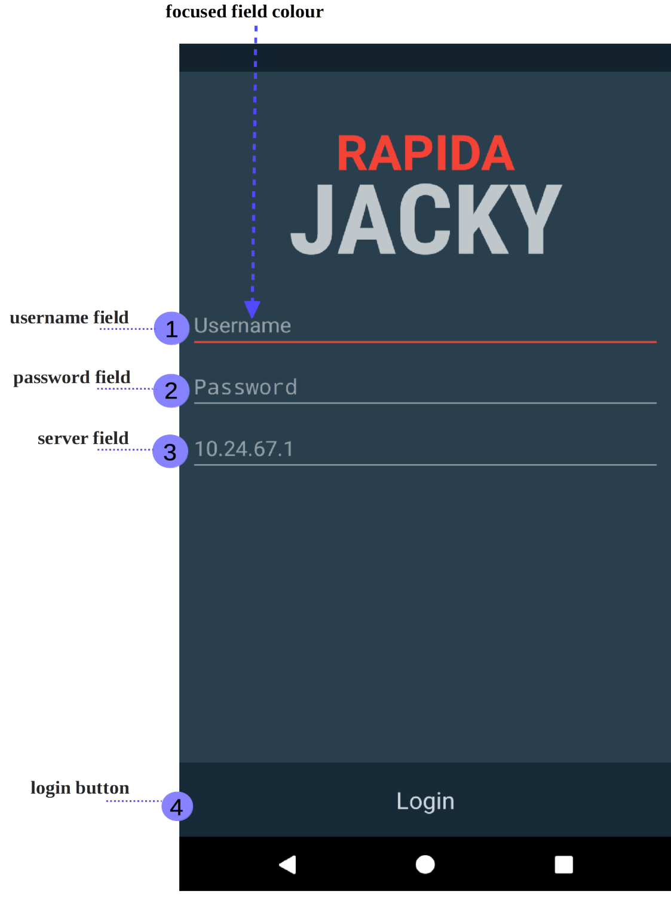
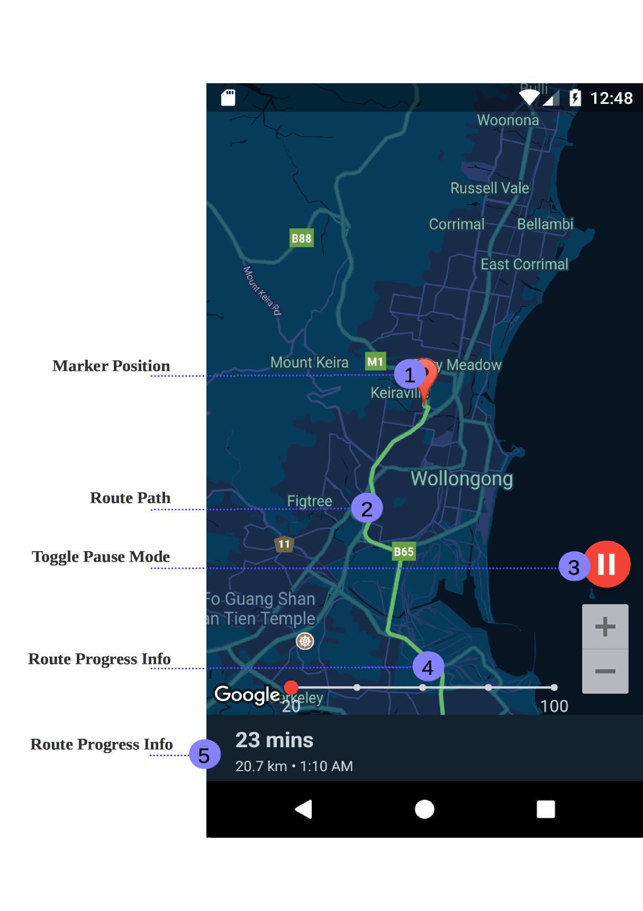

.. _mobile_process:

Using the Mobile Application
############################

This chapter discerns details about different aspects of the mobile application. An overview heads the chapter, which lays out the purpose and overall functionality of the mobile application. The other sections cover each section of the the mobile application.

Overview
********

The mobile application has a simple and intuitive process that allows a mobile resource driver to efficiently navigate to an emergency event. A mobile resource driver is an individual who drives a team of first responders to an emergency event, generally being either a police officer, ambulance driver or firefighter. They are allocated emergency events to respond to by the server, and have the option to accept or decline the request. To identify the mobile resource the mobile resource driver must login to the server's authentication system using the mobile application. Responding to requests as well as navigation to requests is also achieved through the mobile application.

The Login Process
*****************

To use the mobile application a user must authenticate with the server, which can be done by entering user credentials (username and password). The credentials provided to the mobile application must already be registered with the server application by a process demonstrated in the *registering an account* section of the web application's documentation.

    Figure 2.1: Sign In Screen

Stepping Through the Process
----------------------------

This section will guide you through the steps necessary to correctly access the application. Consider the above figure (fig. 2.1) showing the sign in screen and the four annotated areas (ann. 1, 2, 3 and 4). The following steps run through how to use this screen, focusing on each annotation separately.

1. Enter your username in the username field (fig. 2.1 ann. 1) by tapping on the screen. The area is enlarged below. Normally the area appears like the password field (fig. 2.1 ann. 2, fig. 2.1.2) shown above, however when tapped on each text field changes to the red hue shown below.

    Figure 2.1.1: Sign In Screen Username Field

2. Do the same process as above for the password field, entering your password in the field (fig. 2.1 ann. 2) enlarged below.
 

    Figure 2.1.2: Sign In Screen Password Field

3. This step requires you to check the server field (fig. 2.1 ann. 3). The server address field is the ip address that the application authenticates the account information with. The area you must enter the server address into is enlarged below.

    Figure 2.1.3: Sign In Screen Server Address Field
   
.. note:: Before logging in a user should always check the server IP is correct. It should be the IPv4 address on the computer the server is running on.  To avoid repeatedly changing the address you may wish to look into port forwarding. This project is implemented in a way that does not assume nor expect port forwarding. Later versions of this software, if completed, will not require the server address.

4. The final annotation from figure 2.1 (ann. 4) identifies the login button at the bottom of the screen. When this button is pressed, the mobile application attempts to login the user. If the user's credentials are validated the user is logged into the system. The button is shown (enlarged) below.

    Figure 2.1.4: Sign In Screen Login Button

Receiving Requests
******************

Once you are logged into the mobile application, the application will wait until a request is received from the web application. This screen does not require user input.

    Figure 2.2: Awaiting Request Screen

Above is the screen presented whilst a request has still not been received. A dialog will appear when a request is incoming. Once the request is received, the request screen will appear. 

Responding to Requests
**********************

To help a user appropriately respond to a mobile request, the most relevant information pertaining to the request is presented to the user before they have to respond. This information includes the street address of the destination, arrival deadline, route overview, the event's severity and the event's classification.

.. figure:: img/mobile_request_manual.png
    :scale: 33%
    :align: center
    :alt: Request Screen

    Figure 2.3.1: Request Screen

The destination, classification and deadline are shown above (ann. 2, 3, 4). Once this information is reviewed, a response can be selected from the dropdown toggle (ann. 1).

Stepping Through the Process
----------------------------

1. When you tap the red clipboard button, a dropdown like the one below will appear. The first from the top declines the request, returning to the awaiting request screen (fig. 2.2). The other will accept the request, and you will be taken to the map screen.

    Figure 2.3.2: Request Screen Options

2. Tapping one of the options will cause a dialog to appear like below. If you tap **confirm** the request will either be allocated to your account (if you accept), or other resources will be allocated to the request, and you will be returned to the map screen.

3. You will then be redirected to the "On Request" screen.

Viewing the Route
*****************

Viewing the route in the current version of the application is optimised for demonstration and simulation purposes, having both a static camera (bird's eye view) mode and a moving camera (tilted view) mode. Controls are provided on the screen for demonstration purposes (red controls) and for rotating and positioning the Google Map display.

There are two primary controls for demonstration purposes. They are coloured red, and allow the user to stop and change the speed of the mobile resource.

* **Speed Scale:** In the mobile application you can speed up the vehicle by scaling how fast the vehicle moves. The vehicles speed can be multiplied by 20, 40, 60, 80 and 100 times the normal driving pace of the trip. The vehicles increase in speed is independent of the web application's speed up and slow down functionality.

* **Pause Mode:** The mobile resource can be stopped by pressing the "pause mode" button. By tapping the button again the mobile resource resumes. It simulates time being stopped, however it works independently of the web application, as otherwise both would be stopping and starting constantly. The same is applied to the speed scale controls.

