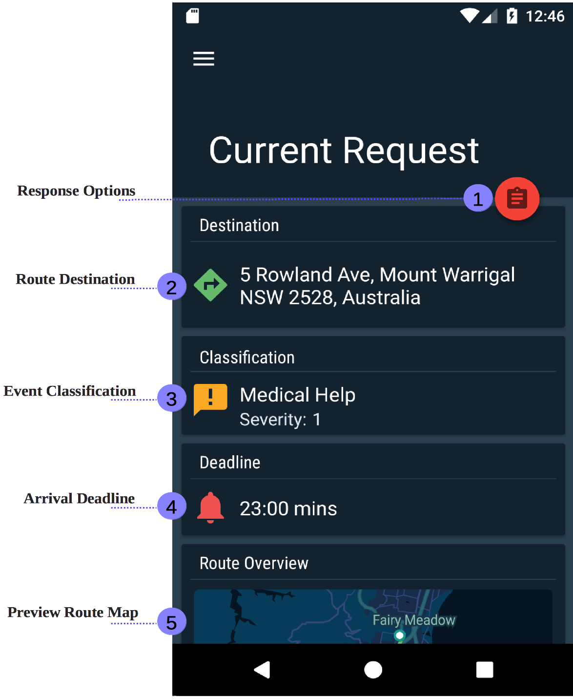

.. _mobile_process:

Using the Mobile Application
============================

This chapter discerns details about different aspects of the mobile application. An overview heads the chapter, which lays out the purpose and overall functionality of the mobile application. The other sections cover each major stage of using the mobile application.

Overview
--------

The mobile application has a simple and intuitive process that allows a mobile resource driver to efficiently navigate to an emergency event. A mobile resource driver is an individual who drives a team of first responders to an emergency event, generally being either a police officer, ambulance driver or firefighter. They are allocated emergency events to respond to by the server, and have the option to accept, decline and delay the request. To identify the mobile resource the mobile resource driver must login to the server's authentication system using the mobile application. Responding to requests as well as navigation to requests is also achieved through the mobile application.

The Login Process
-----------------

To use the mobile application a user must authenticate with the server, which can be done by entering a user's credentials (username and password). The credentials provided to the mobile application must already be registered with the server application by a process demonstrated in the *registering an account* section of the web application's documentation.

.. figure:: img/mobile_login_manual.png
    :scale: 33%
    :alt: Login Screen Image

    Figure 2.1: Sign In Screen

Consider the above figure showing the sign in screen. Annotations 1 and 2 relate to the login fields, being the username and password of the account. As mentioned earlier, an user enter there username and password into these fields to both gain access to the mobile application's features, as well as authenticate with the server. Below these fields is the server address field, which is the ip address that the application authenticates the account information with. This field is included in this release since currently the server application runs off a computer using a non-static IP.

.. note:: Before logging in a user should always check the server IP is updated to the current IPv4 address. To avoid repeatedly changing the address you should look into port forwarding.

The final annotation (4) identifies the login button at the bottom of the screen. When this button is pressed, the mobile application attempts to login the user. If the user's credentials are validated the user is logged into the system.

Receiving Requests
------------------

Once you are logged into the mobile application, the application will wait until a request is received from the web application. This screen does not require user input.

Above is the screen presented whilst a request has still not been received. A dialog will appear when a request is incoming. Once the request is received, the request screen will appear. 

Responding to Requests
----------------------

To help a user appropriately respond to a mobile request, the most relevant information pertaining to the request is presented to the user before they have to respond. This information includes the street address of the destination, route overview, the event's severity and the event's classification.

    Figure 2.2: Request Screen

Viewing the Route
-----------------

