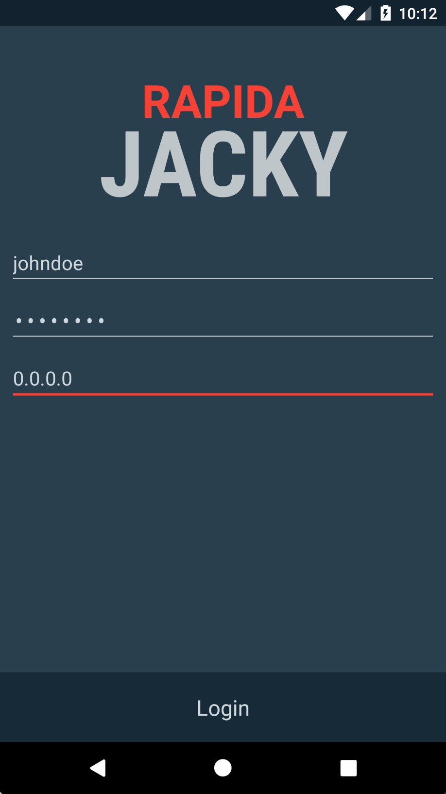
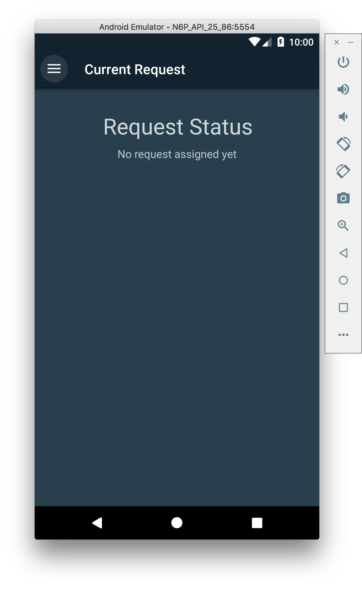
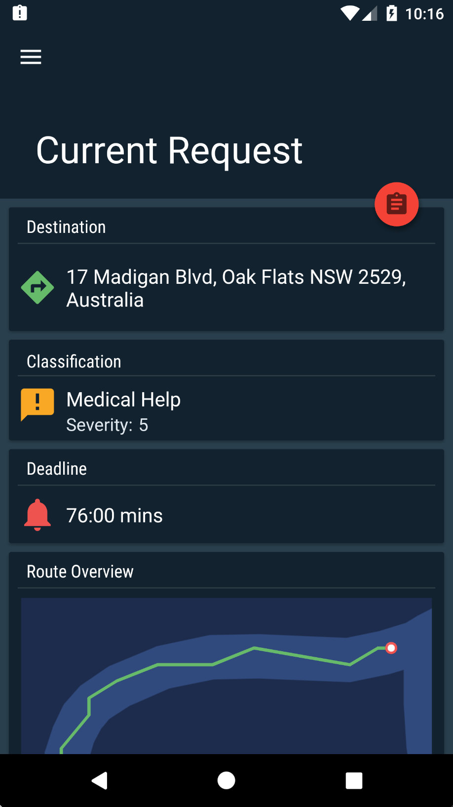
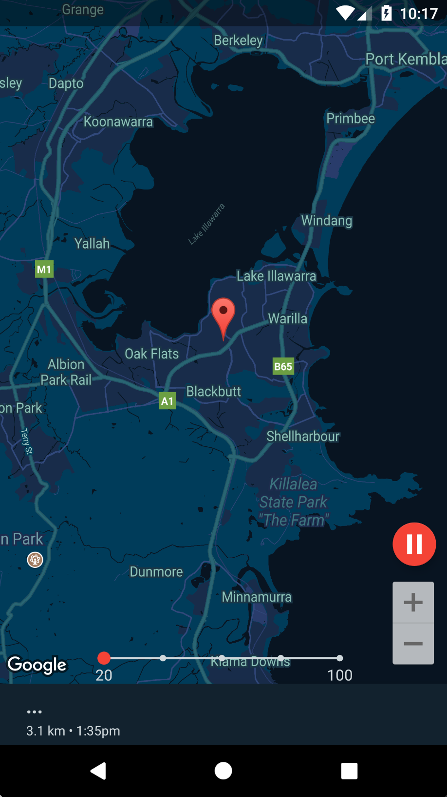

.. _quickstart:

Quickstart Guide
================

Web Application Quickstart
--------------------------

1.	Follow the installation instructions to install the environment and dependencies. 
2.	Start the server (*npm install*) and the application is running at localhost:3000. 
3.	The default page is for the single event simulation.

Mobile Application Quickstart
-----------------------------

.. note:: During this process all dialog's should be responded to by "confirm" or "ok".

1. Follow the installation instructions to install the mobile application onto your android device.
2. Open the application
3. Enter your username, password and server address.

    Figure 0.1: Login Screen

4. Await request

    Figure 0.1: Awaiting Request Screen

5. When request received, press the assignment dropdown button (red) and then press the accept button (green) that appears.

    Figure 0.1: Request Screen

6. Here you view the mobile as it completes the request. There are a few controls on this screen.
   
* Use the slide at the bottom of the current screen to speed up the request and the play/pause button to stop the simulated mobile resource (both red). 
* Use hand gestures to rotate the map that you see on the screen at this stage.

    Figure 0.1: Map Screen

7. Once the request is complete, go back to step 4. At this stage you may go back to the login screen swipe from the left and press "sign out" on the drawer that appears.
