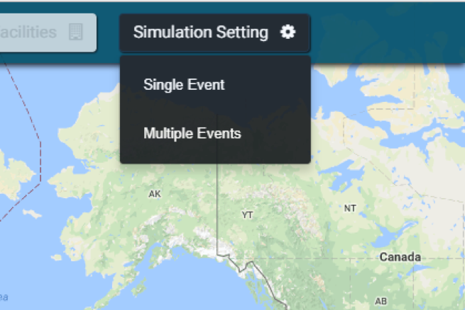
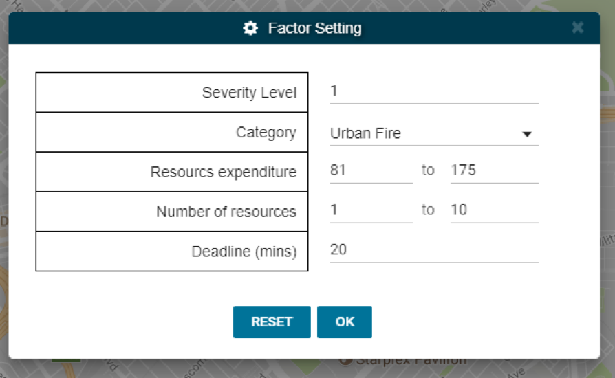
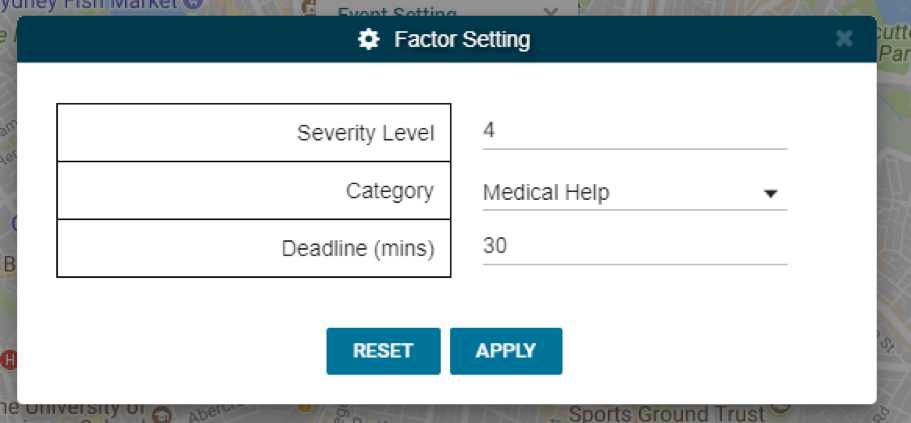
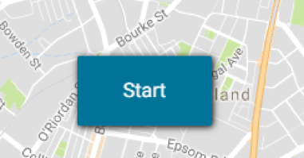
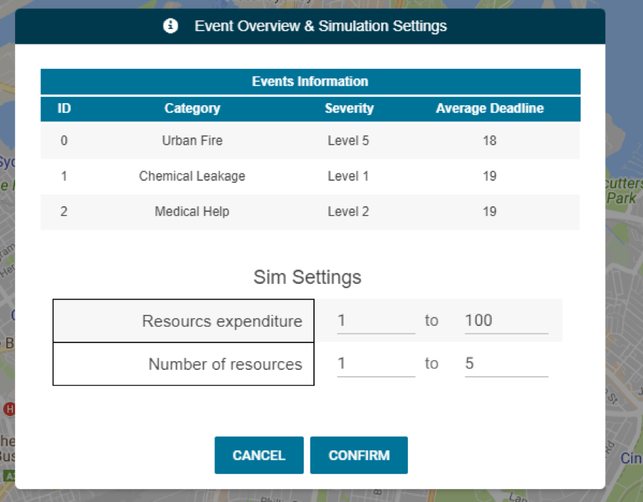
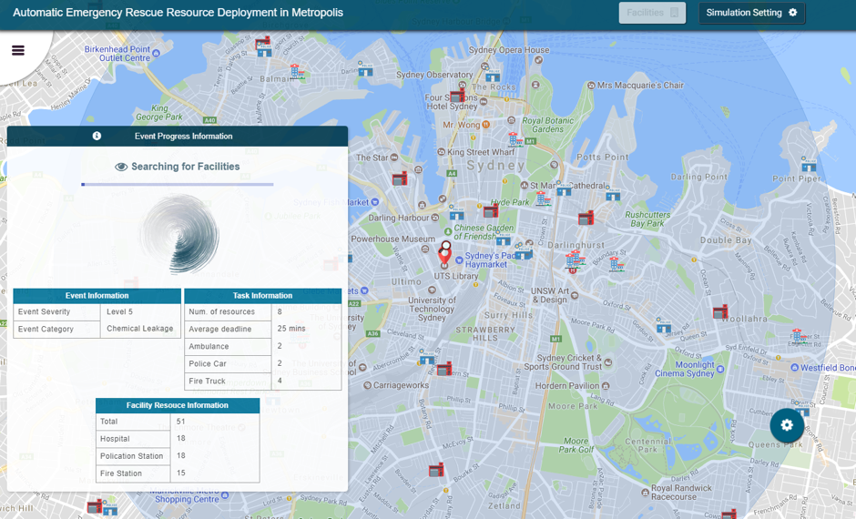
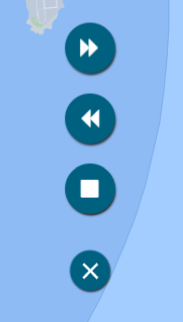
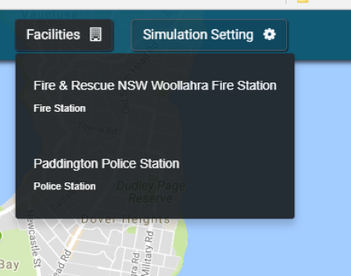
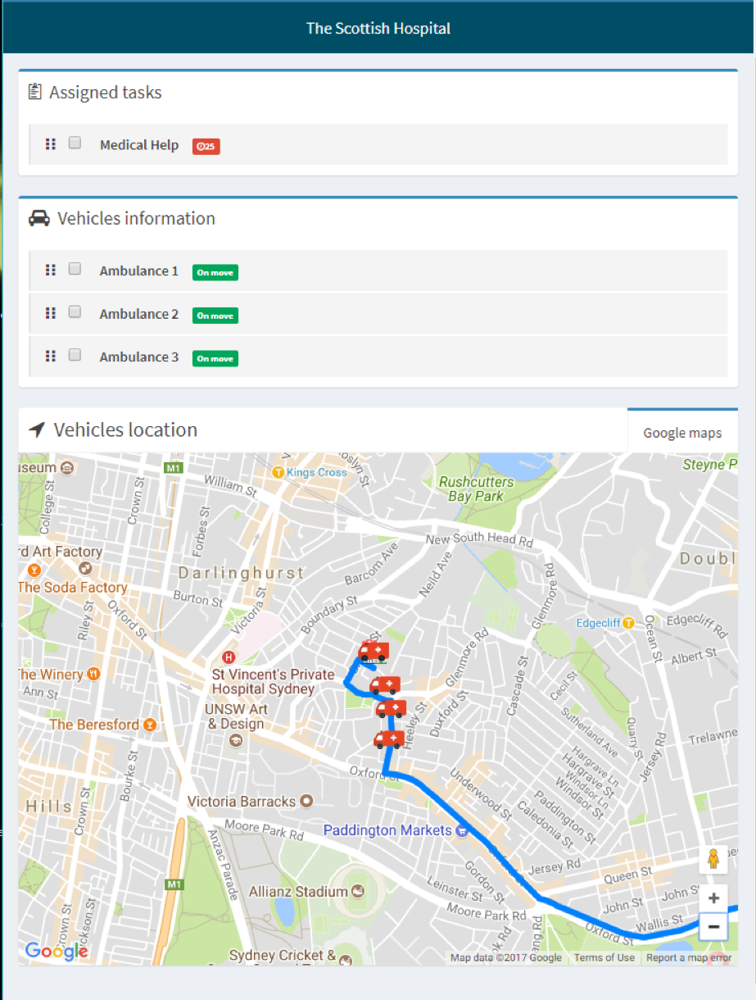
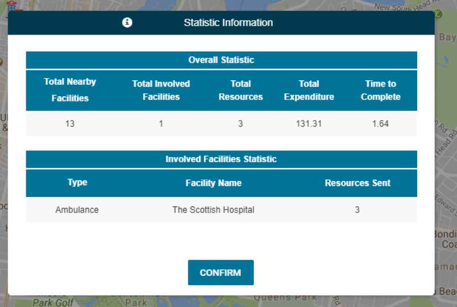

.. _web_allocation:

Using the Web Allocation System
###############################

This chapter discerns details about various aspects of the web application. An overview heads the heads the chapter, laying out the purpose and overall functionality of the web application. The other sections cover each component of the web application.

Overview
********

The web application has a simple and intuitive process that allows a user to step through the different stages of the emergency resource allocation and response simulation. The web application is the driving component of the system. It is from the web application the user will initiate the factors of each event either within a single event or multievent mode. Once a user is happy with their setup they can initiate the simulation to begin the search and allocation of resources to an emergency event and in some situations, interact with the mobile application. Throughout this process, a user will be able to view details of the simulation either through dialog boxes and a separate facility window.

The Simulation Setup
********************

Simulation Mode
===============

On loading the web application, a user will be presented with a world map provided by Google Maps with a selection of option that can be chosen. By default, the simulation will be set in a single event mode, however from the ‘Simulation Setting’ the user can select the mode they wish to perform, either single event or multiple events. The main difference between the two modes is as suggested by the names, the single event only allows for a single emergency event to be defined, while the multiple event mode allows for multiple events to defined and processed in a single event while handling any collisions in emergency resources being allocated to multiple events.

    
    Figure 1.1: Simulation Settings Drop Down

Location Selection
==================

Once a mode has been selected a user several means in which allow them to select the location of any of the emergency events. To begin with a user can navigate the actual Google Map by dragging and zooming as one typically can. Through the use of the search box as user can also jump to a specific location very easily. In the singe event mode this will also place a marker at the searched location, however in the multiple event mode the map will just jump to the location without placing any markers. The user also has the option of selecting the marker button from the top corner menu which will convert the cursor into a marker which can be placed on the map at any position by a simple click. Alternatively, the user can let the application assign the marker by user’s current location by selecting the target button or a random location from a list of location by selecting the shuffle button. These markers are also draggable to readjust their position.

.. figure:: img/loc_select.png
    :align: center
    :scale: 33%
    
    Figure 1.2: Request Allocation Controls

Setting Event Details
=====================

Once a user is happy with their selected location, the user can specify details for the event to be simulated. These factors include the severity, level, category/type of event, a range for the expenditure or resources, the number of resources a facility and the deadline for the event.

    
    Figure 1.3: Simulation Settings

In the case of the simulation being in multiple events mode, the resource expenditure and number of resources are not included within the factor settings as can be seen in the Multiple Events – Factor Settings when setting up each event. This is due to these values being set globally across all events and as such have been relocated to the Event Overview & Simulation Settings Dialog box.

    
    Figure 1.4: Request Settings Subwindow

Once the user has set the values for the events and simulation, the user can then start the simulation by selecting the now available start button at the bottom of the window. 

    
    Figure 1.5: Begin Request Button

In the case of the multiple events, the user will be presented with an overview of all their generated events and to set the final simulation settings before finally confirming for the simulation to begin.

    
    Figure 1.6: Event and Simulation Overview

Simulation Process
******************

Simulation Window
=================

Once the simulation has begun, there is very little actions for the user to perform and interact with the system. Throughout the several phases of the simulation the user will be presented with various pieces of information within the dialog boxes while being presented with markers and animation of the Google map showing the simulation progress and allocation of emergency resources.

    
    Figure 1.7: Full Simulation Window

In addition, the user can also select the sprocket, in the corner. This socket allows the user to perform a few extra functionalities on the simulation while it is occurring. To start off, the user will be able to stop the event resulting in the confirmation being asked to stop the simulation. If stopped, the page will be refreshed to allow for a new simulation to begin. Alternatively, the user can control the speed of the vehicle animation by either speeding it up or slowing it down. This does not affect the results of the simulation and the allocated resources, it just affects the display of them.

    
    Figure 1.8: Begin Request Button

Facility Window
===============

    
    Figure 1.9: Facilities Dropdown

Once resources have been allocated, a user can select the facilities drop down button and select a facility with an active resource in the current simulation. On selecting a facility, the user will be presented with a new window presenting information about that specific facility and its active resources on an event as can be seen below image.

    
    Figure 1.10: Facilities Dropdown

Simulation End
--------------

On the arrival of all emergency resources to the emergency event, a user will be presented with some statistical information regarding the simulation before end the simulation completely.

    
    Figure 1.11: Statistics Information

